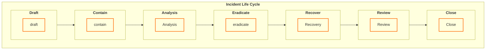

```mermaid


flowchart TB
    classDef default fill:none, stroke:#ff6600, stroke-width:2px, color:#333
    classDef decision fill:#ff6600, stroke:#333, stroke-width:2px, color:#fff, shape:diamond;
    classDef containStyle stroke-dasharray: 5 5


draftSub-->containSub
containSub-->AnalysisSub
AnalysisSub-->eradicateSub
eradicateSub-->recoverSub
recoverSub-->reviewSub
reviewSub-->closeSub


subgraph sirlifecycle__Sub["`**Incident Life Cycle**`"]

  subgraph closeSub["`**Close**`"]
  
    direction LR
    Close
  end


  subgraph reviewSub["`**Review**`"]
    
    direction LR
    Review
  end

  subgraph recoverSub["`**Recover**`"]
    
    direction LR
    Recovery
  end

  subgraph eradicateSub["`**Eradicate**`"]
    
    direction LR
    eradicate
  end

  subgraph AnalysisSub["`**Analysis**`"]
    
    direction LR
    Analysis
  end

  subgraph containSub["`**Contain**`"]
    
    direction LR
    contain
    
  end

  subgraph draftSub["`**Draft**`"]
    
    direction LR
    draft
    
  end

 end

```
