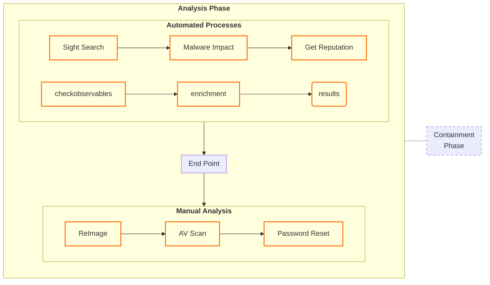

### Malware Process

```mermaid


flowchart LR
    classDef default fill:none, stroke:#ff6600, stroke-width:2px, color:#333
    classDef decision fill:#ff6600, stroke:#333, stroke-width:2px, color:#fff, shape:diamond;
    classDef containStyle stroke-dasharray: 5 5
subgraph analysis__Sub["`**Analysis Phase**`"]
  subgraph analysis_automated_items["`**Automated Processes**`"]
    
    direction LR
    analysisSightSearch[Sight Search]-->
    analysisMalwareImpact[Malware Impact]-->
    analysisGetReputation[Get Reputation]
    checkobservables-->enrichment
    enrichment-->results(results)
  end
  subgraph analysis_manual_steps__Sub["`**Manual Analysis**`"]
   direction LR
      rebuild[ReImage]-->
      avscan[AV Scan]-->
      passwordreset[Password Reset]


    
  end 
  subgraph endpoint__Sub[End Point]
  direction TB
  end

analysis_automated_items-->endpoint__Sub["fa:fa-twitter for peace"]

endpoint__Sub-->analysis_manual_steps__Sub


end

subgraph containmenet__Sub["`Containment
 Phase`"]
end

analysis__Sub-.-containmenet__Sub:::containStyle

```
